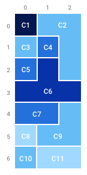

# Number of countries on a map

> Author: Mahdi Aouchiche (<https://github.com/mahdi-aouchiche/number-of-countries-on-a-map>)

## Overview

A rectangular map consisting of N rows and M columns of square areas is given.
Each area is painted with a certain color.
Two areas on the map belong to the same country if the following conditions are met:
    • They have the same color;
    • It is possible to travel from one area to the other orthogonally, that is, by moving only north, south, west or east, without moving over areas of a different color.
The map can be described by a zero-indexed matrix 'map' consisting of N rows and M columns of integers.
The color of each area is described by the corresponding element of the matrix.
Two areas have the same color if and only if their corresponding matrix elements have the same value.
For example, consider the following matrix map(7x3) consisting of seven rows and three columns:

```matrix map
      0   1   2
0   | 5 | 4 | 4 |
1   | 4 | 3 | 4 |
2   | 3 | 2 | 4 |
3   | 2 | 2 | 2 |
4   | 3 | 3 | 4 |
5   | 1 | 4 | 4 |
6   | 4 | 1 | 1 |
```

Matrix 'map' describes a map that is colored with five colors.
The areas on the map belong to eleven different countries (C1−C11), as shown in the following figure:



Write a function

```c++
    int number_of_countries(int[][] map);
```

that, given a zero-indexed matrix 'map' consisting of N rows and M columns of integers, returns the number of different countries to which the areas of the map described by matrix map belong.
For example, given matrix 'map' consisting of seven rows and three columns corresponding to the example above, the function should return '11'.
Write an efficient algorithm for the following assumptions:
    • N and M are integers within the range [1..300,000];
    • The number of elements in matrix 'map' is within the range [1..300,000];
    • Each element of matrix 'map' is an integer within the range [−1,000,000,000..1,000,000,000].

> Note: This project is a C++ implementation of the problem "Number of countries on a map" using the breadth-first search (BFS) algorithm. The BFS algorithm is used to traverse the map and count the number of distinct countries based on the given conditions.

### To run the project nicely use the following commands

```c++
cmake -S . -B build
cmake --build build/ 
```

### 1 executable is created, use the commands to run the executable

```c++
./build/number_of_countries
```
